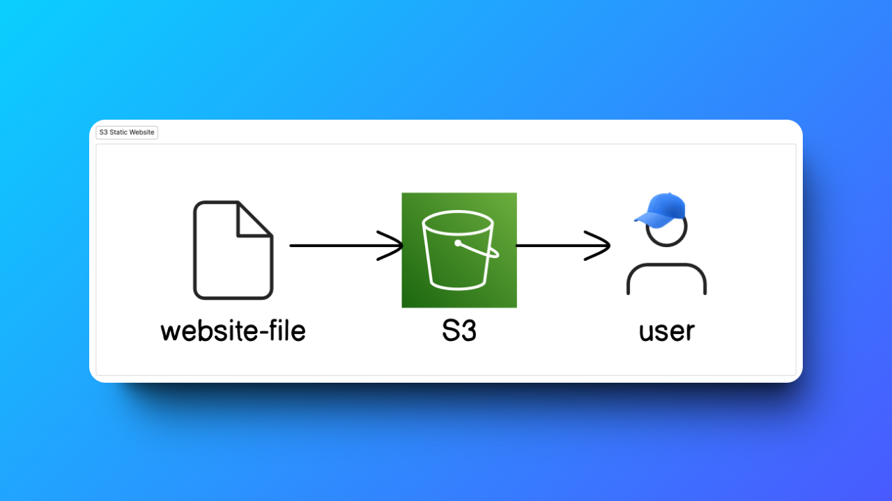
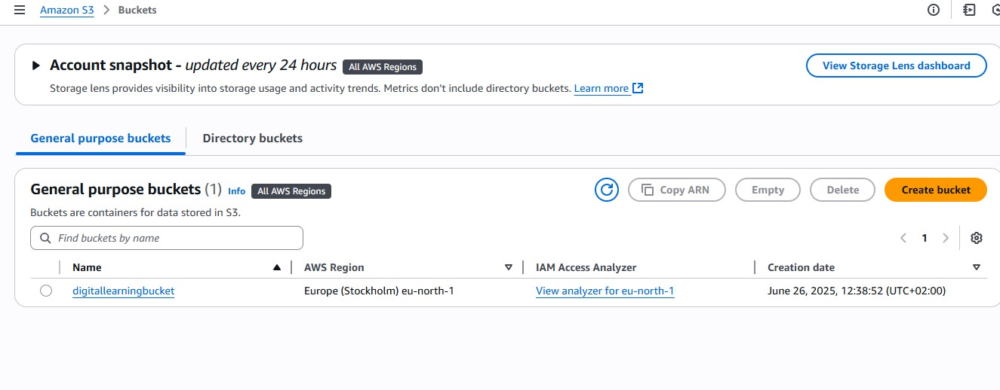
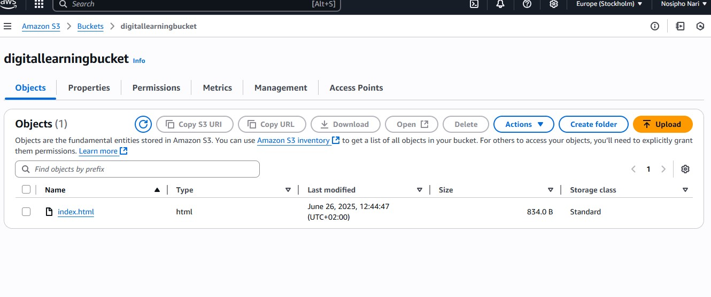
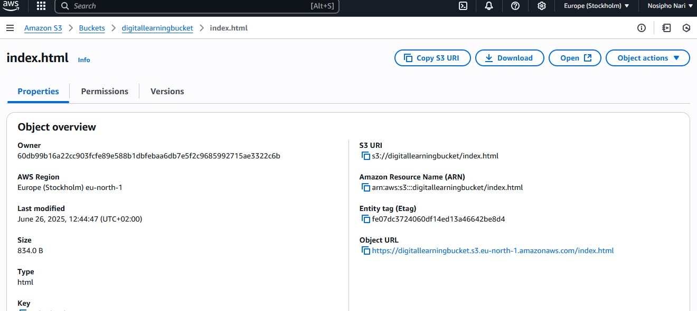

# AWS S3 Static Website Hosting Project

## Overview
This project demonstrates how to host a static website using Amazon S3. The website is a simple HTML page with associated assets, fully hosted on S3, showcasing how to leverage AWS for static content delivery.

 
## Features
- **Static Website Hosting**: Accessible via a public URL provided by S3.
- **Access Management**: Implemented AWS S3 Bucket Policies and ACLs to control public access.

## Setup and Deployment

### Step 1: Create an S3 Bucket
1. Log in to the [AWS Management Console](https://aws.amazon.com/).
2. Navigate to the `S3 service`.
3. Create a new bucket:
   * Give it a unique name (e.g., my-awesome-website-bucket).
   * Choose a region closest to your target audience (e.g., Oregon `us-west-2`).
4. Enable ACLs:
   * During bucket creation, under "Object Ownership," select ACLs enabled.
   * This allows fine-grained control over the permissions of individual objects in the bucket.



### Step 2: Upload Files

1. Upload your website files:
   * Upload index.html to the S3 bucket.
   
### Step 3: Configure the Bucket for Static Website Hosting
1. Go to the bucket properties in the S3 console.
2. Enable static website hosting:
   * In the "Static website hosting" section, choose Enable.
   * Set index.html as the Index document.
   




### Step 4: Access the Website
* Use the bucket's public URL to access the website.
  It typically looks like:
```
http://your-bucket-name.s3-website-region.amazonaws.com
```

 

### Access Control Lists (ACLs)
ACLs are a set of rules that determine who can access your S3 resources. In this project, ACLs were used to manage public access to the website.

* Why Use ACLs?: ACLs allow you to grant specific read/write permissions to different AWS accounts or make the content public. This provides more granular control compared to bucket policies.

* Implementation:
    * After uploading your files, select them in the S3 console.
    * From the "Actions" dropdown, choose "Make public using ACL".
    * This action grants public read access to the website files, resolving any 403 errors when accessing the bucket endpoint.

### Project Architecture
The project uses Amazon S3 to host a static website, where the following steps were performed:

* **S3 Bucket:** Created for storing the website files.
* **Website Hosting:** Enabled to make the bucket's content publicly accessible.
* **ACLs:** Configured to allow public access to the website.
