# BankerBot 🏦🤖

> My personal project: a conversational **banking chatbot** built using Amazon Lex. This README is written like a step-by-step journal so I can explain what I did, why I did it and show my screenshots along the way.

---

## What is Amazon Lex?
Amazon Lex is an AWS service for building conversational interfaces (chatbots). It’s the same tech that powers Alexa but you can use it for your own projects. With Lex you can:
- Define **intents** (what the user wants to do)
- Define **slots** (details needed to complete the intent)
- Add **prompts and responses**
- Connect to **Lambda functions** for backend logic

👉 The purpose of this project: I built **BankBot** to help customers **check their balance** and **make transfers** (simulated, of course).

---

## Step 1 — Create the Bot 🛠️
- Went to Amazon Lex console → created a traditional blank bot.
- Named it **BankerBot**
- Description: *“Banker Bot to help customers check their balance and make transfers”*
- Selected **English (South Africa)** → Voice: Ayanda
- Intent classification confidence score threshold: `0.40`

📸 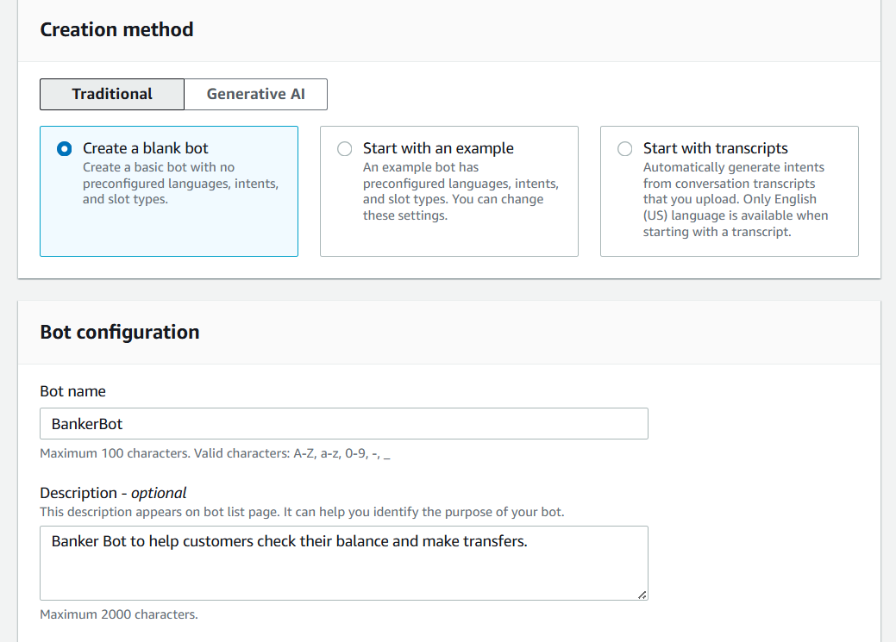

📸 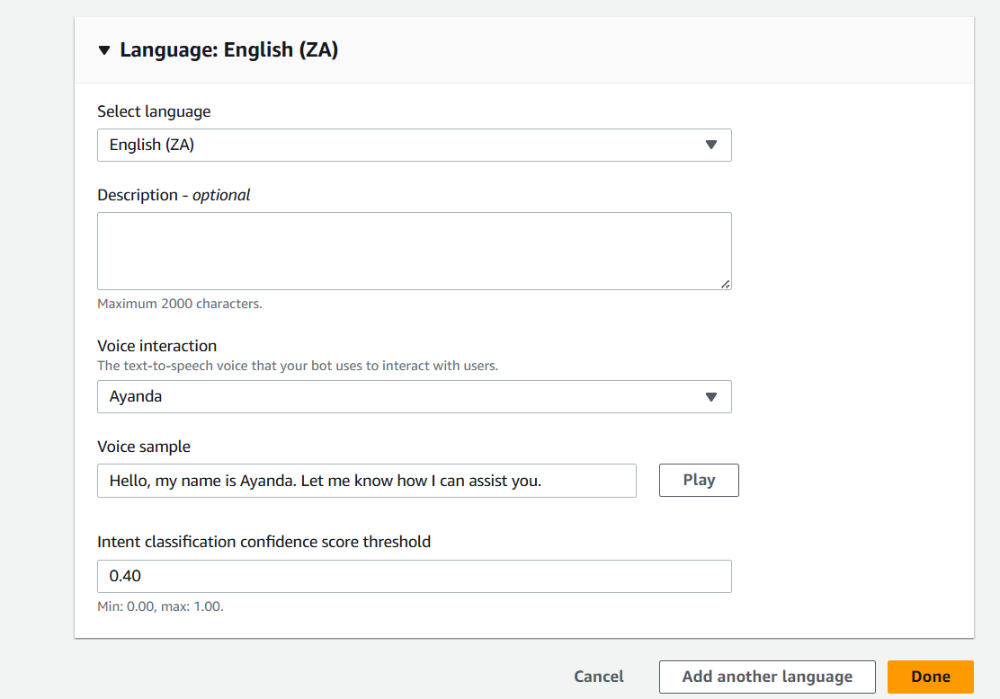

Created the bot successfully!

---

## Step 2 — Welcome Intent 👋
- Created an intent called **WelcomeIntent**
- Description: *“to welcome a user when they greet”*
- Added sample utterances:
  - Hi
  - Hello
  - I need help
  - Can you help me?

📸 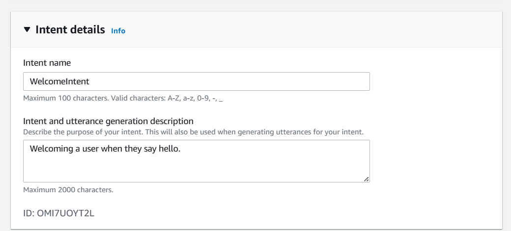

📸 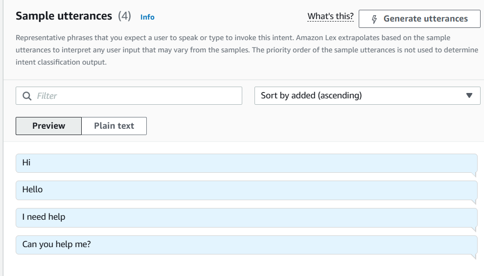

📸 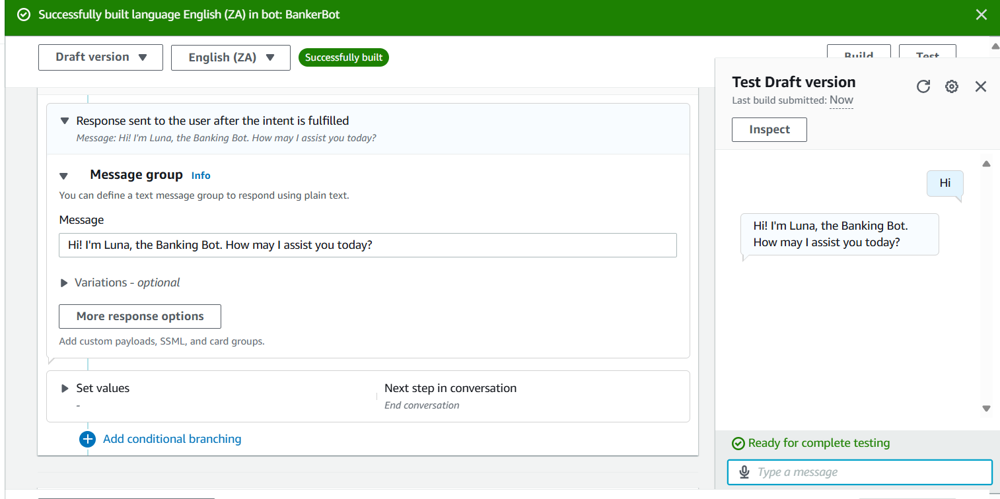

Test result: when I typed *“Hi”*, the bot replied:
> *“Hi, I’m Luna the banking bot. How may I assist you today?”*

✅ Responsive → success!

---

## Step 3 — Fallback Intent 🚧
Sometimes the bot won’t understand the user. That’s where fallback comes in.
- Added fallback messages:
  - *“Sorry, I’m having trouble understanding. Can you describe what you’d like to do in a few words?”*
  - *“Could you try rephrasing that?”*
  - *“Sorry, I didn’t get that. I can help you find your bank balance, transfer funds, and make a payment.”*

📸 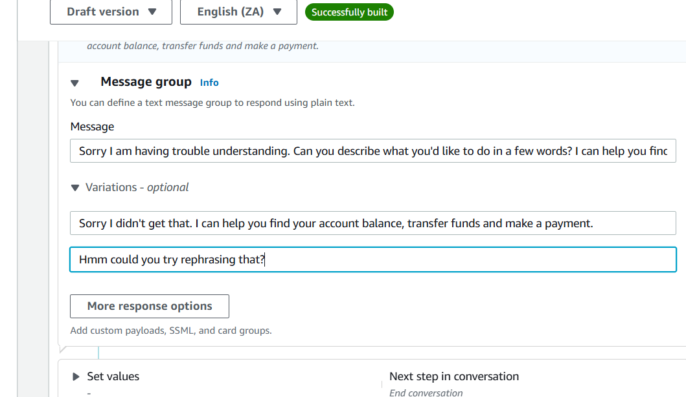

Tested by typing *“Create an account”* → bot responded with fallback message. Yay it works!

📸 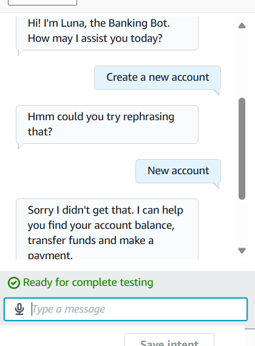

---

## Step 4 — Slot Types 🧩
- Created a custom slot type called **AccountType**
- Values: `cheque`, `savings`, `credit`

📸 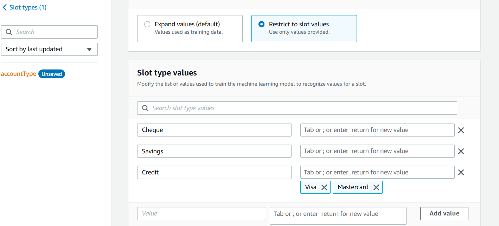

---

## Step 5 — Check Balance Intent 💰
- Created intent: **CheckBalanceIntent**
- Description: *“to check the balance in the specified account type”*
- Sample utterances:
  - I want to check my balance
  - Check my balance
  - What is the balance in my account

📸 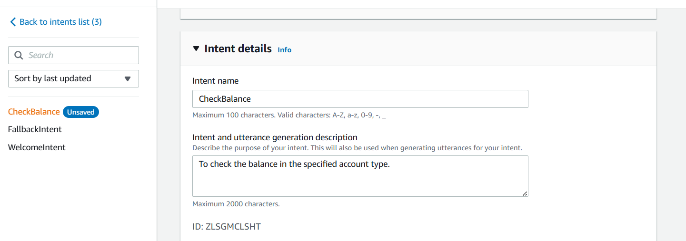

📸 

Slots:
- `AccountType` (from earlier slot type)
- `DateOfBirth` (system slot: `AMAZON.Date`)
- Prompt: *“For verification purposes, what is your date of birth?”*

📸 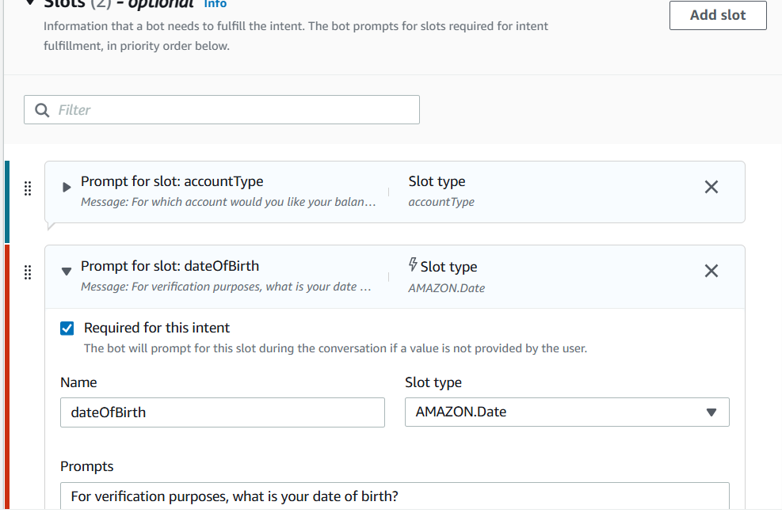

Test: Bot asked for account type → then DOB → then fulfilled intent.

📸 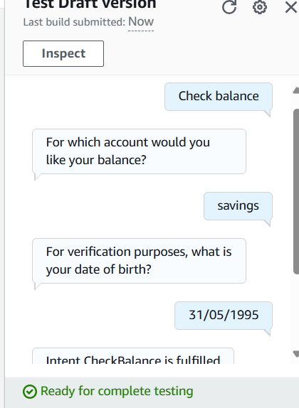

✅ It worked!

---

## Step 6 — Lambda Integration ⚡
- Went to AWS Lambda
- Created function: **BankingBotEnglish**
- Pasted my python code 
- Deployed function

📸 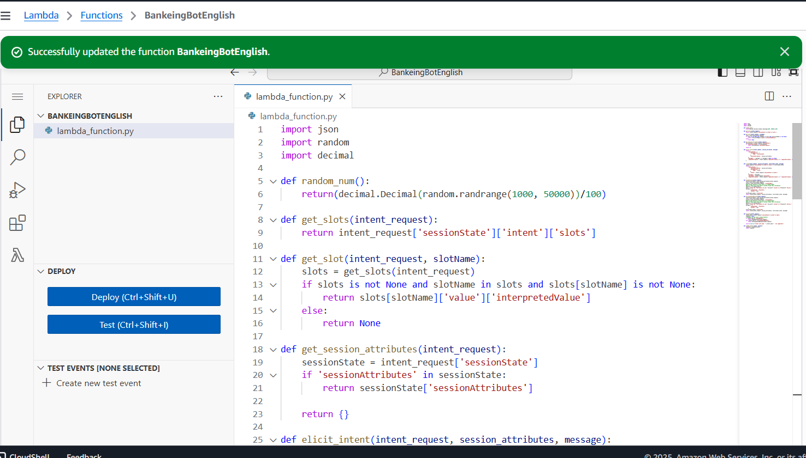

Linked the Lambda in Lex alias (English ZA, latest version).

📸 


Test: Asked for balance → bot responded with a random balance (e.g., R327.45). Nice! Success!!!

📸 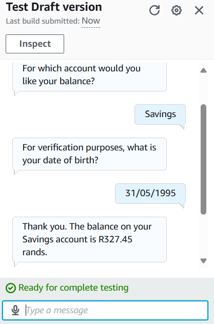

---

## Step 7 — Transfer Funds Intent 💸
- Created intent: **TransferFundsIntent**
- Description: *“to help users transfer funds between bank accounts”*

📸 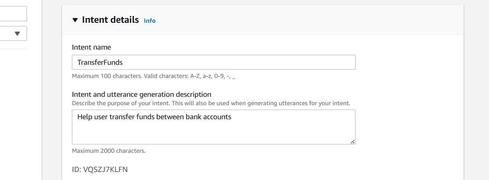

Slots added:
- `SourceAccountType`
- `DestinationAccountType`
- `Amount`

📸 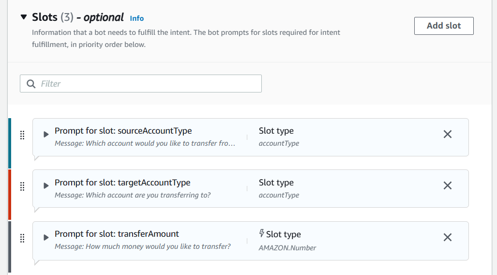

Bot prompts:
- *“Which account would you like to transfer from?”*
- *“Which account are you transferring to?”*
- *“How much money would you like to transfer?”*

Confirmation prompt:
- *“Got it. So we are transferring [amount] from [source] to [destination]. Can I go ahead?”*
- If declined → *“The transfer has been cancelled.”*

📸 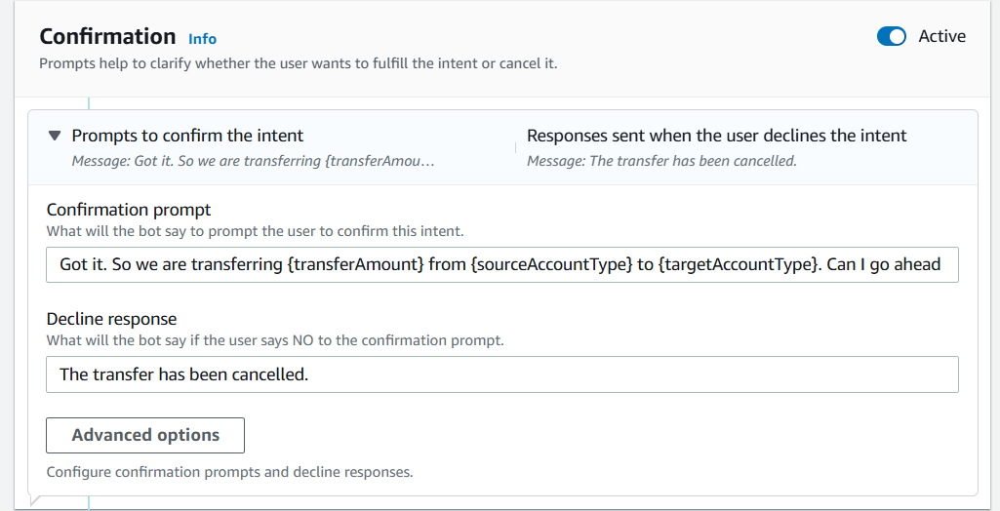

Test: Bot captured slots correctly → confirmed → completed transfer flow.

📸 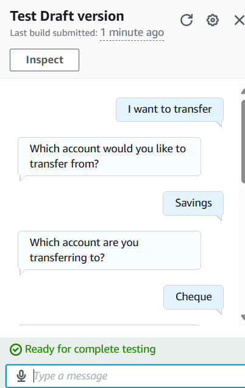

📸 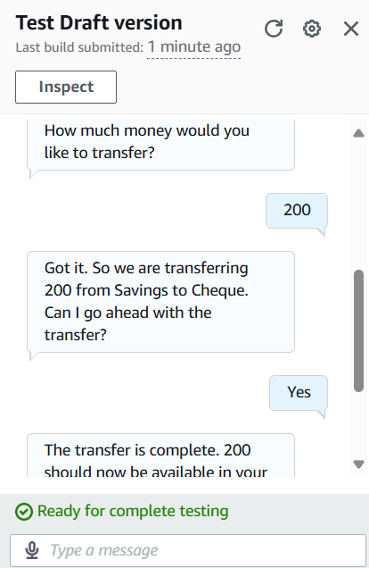

✅ Yayy Success!

---

## Troubles I Encountered 😅
- Lambda not connecting at first → had to double-check region + alias linking.
- Permissions issue → fixed by giving Lambda `AWSLambdaBasicExecutionRole`.
- Some utterances weren’t triggering intents → solved by adding more variations.
- Took a bit of time to understand slots + prompts flow.

---

## Time Taken ⏳
This project took me **about 5 days** from start to finish (including learning, testing, debugging, and taking screenshots).

---

## Reflections 📝
- **Was it easy?** → It was not that bad, at first it felt overwhelming but step by step it became clearer.
- **What did I learn?** → Learned how Lex bots are structured (intents, slots, prompts, Lambda fulfillment).
- **What am I taking forward?** → I now understand the basics of building and deploying a chatbot, linking it with Lambda and handling fallback/error cases.

Overall, I’m proud that I got BankerBot working end-to-end, I would love to experiment more on it, add more intents and make it more user friendly moving forward🚀

---

## Demo Conversations 💬
Some example chats with the bot:

**User:** Hi  
**Bot:** Hi, I’m Luna the banking bot. How may I assist you today?

**User:** What’s my savings balance?  
**Bot:** For verification purposes, what is your date of birth?  
**User:** 1995-05-12  
**Bot:** Your savings account balance is R327.45.
**User:** And the cheque?  
**Bot:** Your cheque account balance is R42.56.

**User:** Transfer 100 from savings to credit  
**Bot:** Got it. So we are transferring R100 from savings to credit. Can I go ahead?  
**User:** Yes  
**Bot:** ✅ The transfer is complete.

---

✨ That’s it! This README is both my guide and my diary of building BankerBot.
```

